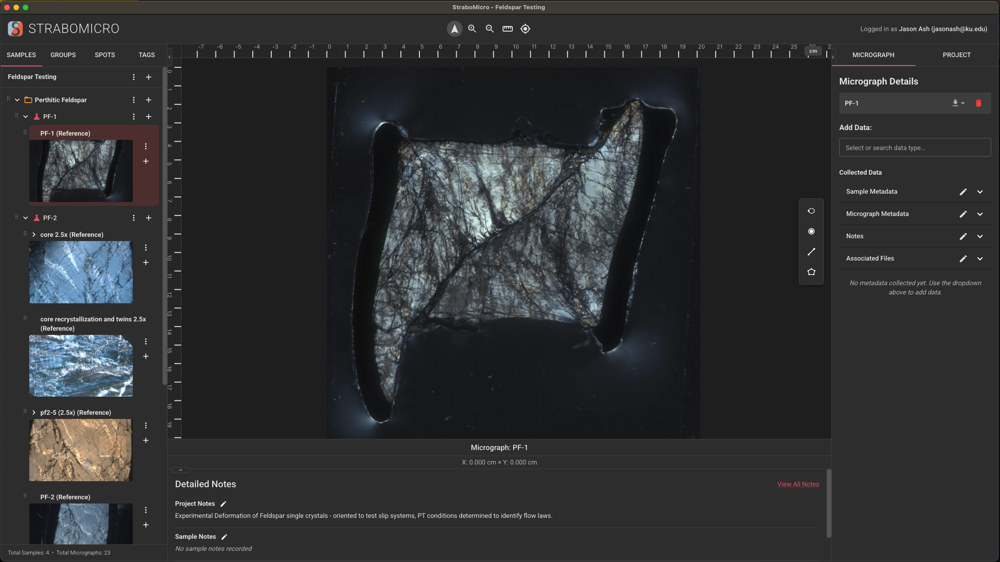

# StraboMicro2

<p align="center">
  
</p>

<p align="center">
  <strong>A modern desktop application for geological microanalysis</strong>
</p>

<p align="center">
  <a href="https://github.com/jasonash/StraboMicro2/releases/tag/dev-latest">
    
  </a>
  
  
</p>

---

StraboMicro2 is a complete rewrite of the original [StraboMicro](https://www.strabospot.org/strabomicro) JavaFX application, rebuilt from the ground up using modern web technologies. It enables geologists to manage, annotate, and analyze thin section micrographs with sophisticated hierarchical image organization and spatial registration.

## Features

### Image Management
- **Large Image Support** - Handle 100MB+ TIFF micrographs with tiled rendering for smooth performance
- **Hierarchical Overlays** - Place child micrographs on parent images with drag, resize, and rotate
- **Multi-format Import** - Support for TIFF, JPEG, PNG, and BMP image formats
- **Drill-down Navigation** - Click overlays to navigate into them, with back button support

### Annotation Tools
- **Spot Types** - Create point, line, and polygon annotations
- **78 Feature Types** - Comprehensive geological classification (grains, fractures, fabrics, veins, folds, and more)
- **Real-time Measurements** - Automatic calculation of length, area, and perimeter with scale calibration
- **Recursive Spots** - View child micrograph spots on parent view with correct transformations

### Project Organization
- **Hierarchical Structure** - Organize work as Project → Dataset → Sample → Micrograph → Spot
- **Version History** - Full project snapshots with restore capability and diff preview
- **Autosave** - Automatic saving with 5-minute inactivity timer
- **Recent Projects** - Quick access to recently opened projects

### Import & Export
- **SMZ Archives** - Full project export/import as .smz files (ZIP format)
- **SVG Export** - Vector export with editable spots and labels for publication
- **JPEG Export** - Composite images with overlays
- **PDF Reports** - Project documentation export
- **JSON Export** - Raw data export for analysis

### Cloud Integration
- **StraboSpot Sync** - Upload and download projects from [strabospot.org](https://strabospot.org)
- **Shared Projects** - Import projects shared by colleagues via 6-character codes
- **Instrument Database** - Access shared instrument configurations

## Screenshots

<p align="center">
  
</p>

## Installation

### Download Pre-built Binaries

Download the latest development build for your platform:

**[Download from GitHub Releases](https://github.com/jasonash/StraboMicro2/releases/tag/dev-latest)**

- **macOS**: DMG installer (Universal - works on Intel and Apple Silicon)
- **Windows**: NSIS installer (.exe)
- **Linux**: AppImage and .deb package

### Build from Source

#### Prerequisites
- Node.js 18+
- npm 9+

#### Steps

```bash
# Clone the repository
git clone https://github.com/jasonash/StraboMicro2.git
cd StraboMicro2

# Install dependencies
npm install

# Run in development mode
npm run dev

# Build for production
npm run build

# Package for your platform
npm run package:mac    # macOS
npm run package:win    # Windows
npm run package:linux  # Linux
```

## Technology Stack

| Layer | Technology |
|-------|------------|
| Framework | [Electron](https://www.electronjs.org/) |
| UI | [React](https://react.dev/) + [TypeScript](https://www.typescriptlang.org/) |
| Canvas | [Konva.js](https://konvajs.org/) |
| State | [Zustand](https://zustand-demo.pmnd.rs/) |
| Components | [Material UI](https://mui.com/) |
| Image Processing | [Sharp](https://sharp.pixelplumbing.com/) |
| Build | [Vite](https://vitejs.dev/) + [electron-builder](https://www.electron.build/) |

## Data Storage

- **Projects**: `~/Documents/StraboMicro2Data/`
- **App Settings**: `~/Library/Application Support/StraboMicro2/` (macOS)
- **Version History**: Stored per-project in app settings folder

## Related Projects

- [StraboSpot](https://strabospot.org) - Field data collection for structural geology
- [StraboMicro (Legacy)](https://www.strabospot.org/strabomicro) - Original JavaFX version

## Contributing

Contributions are welcome! Please feel free to submit issues and pull requests.

## License

MIT License - see [LICENSE](LICENSE) for details.

## Acknowledgments

StraboMicro2 is developed by the [StraboSpot](https://strabospot.org) team with support from the National Science Foundation.
